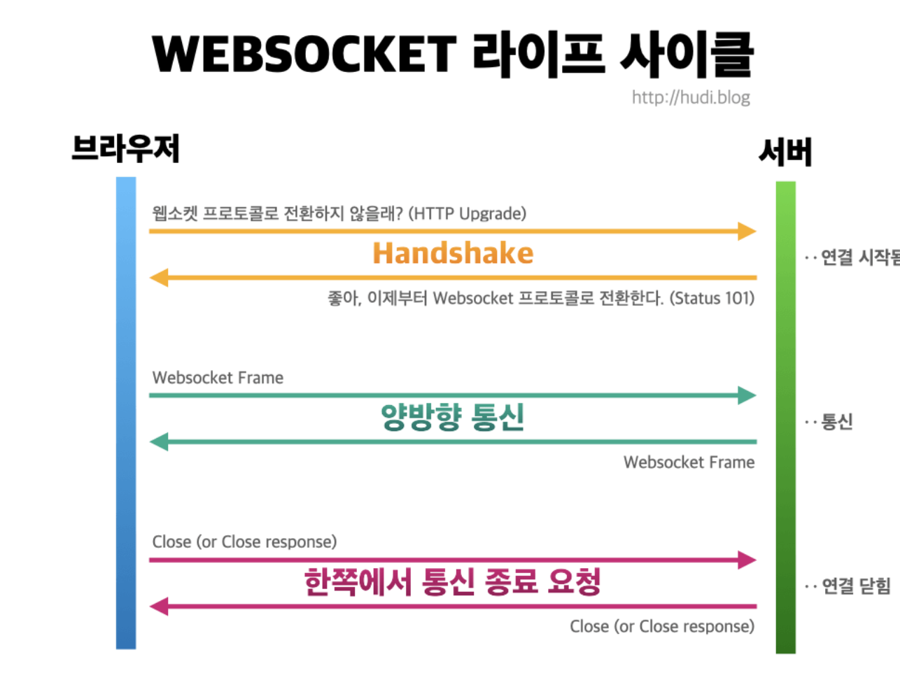
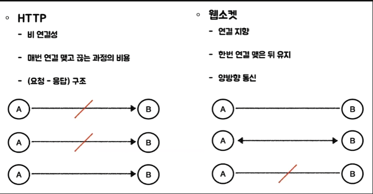
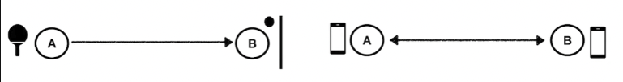
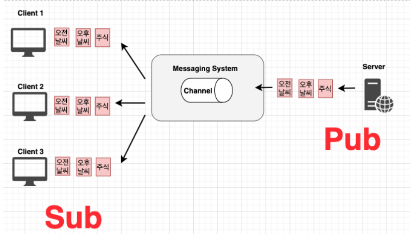
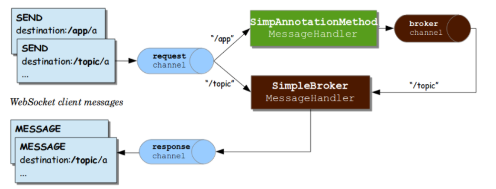
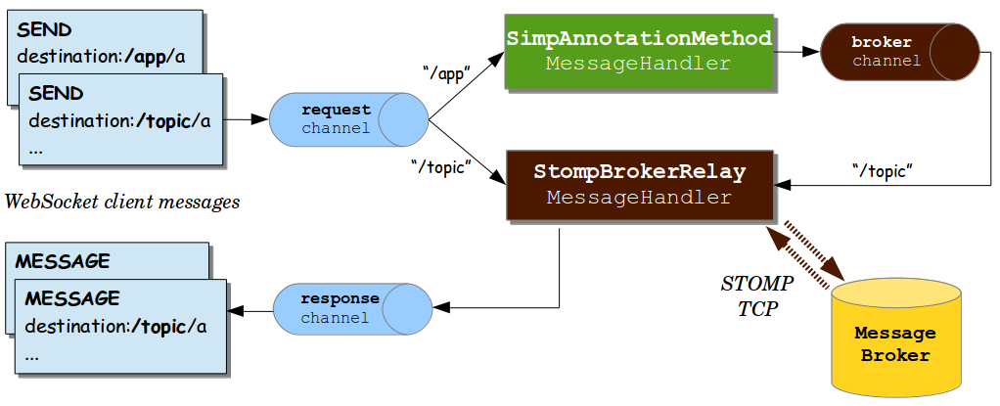
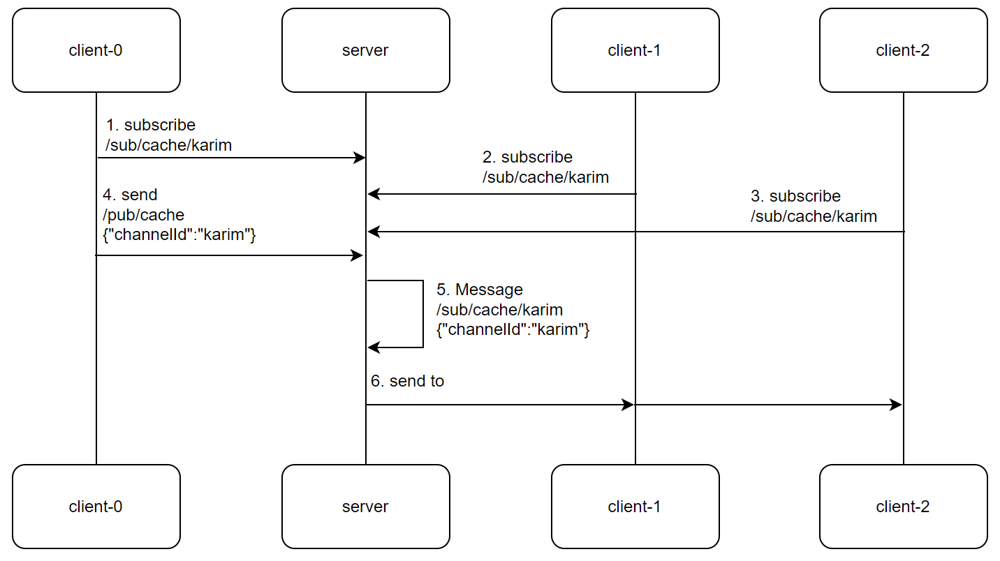

# Stomp Test
- Stomp 통신 학습을 위한 레포지토리

## 학습목표
- WebSocket통신의 이해와 Stomp통신 이해 및 학습

## WebSocket이란?
- 실시간성을 보장하는 서비스 (게임, 채팅, 실시간 주식거래)에서 웹소켓을 사용할 수 있다.

  [출처 : https://velog.io/@mw310/Stomp-WebSocket-%EA%B0%9C%EB%85%90-%EC%A0%95%EB%A6%ACver-Spring]

## WebSocket vs HTTP
[출처 : https://velog.io/@junghunuk456/WebSocket-Stomp]  
  
- HTTP  
    * 클라이언트와 연결을 맺고 끊는다. (비연결성)  
    * 3way, 4way handshake로 연결을 맺고 끊어야 한다.  

- 웹소켓  
    * 한번 연결을 맺고 나면, 그 연결을 계속 유지한다.  
    * 연결을 맺는 과정에서 발생하는 비용을 줄일 수 있다.  

  
- HTTP  
    * 요청과 응답이 하나의 쌍을 이루는 구조로 통신한다.    
    * 원하는 리소스에 대해 서버쪽에 요청을 해야한다.  

- 웹소켓  
    * 연결이 계속 유지되므로, 요청없이 상대가 보낸 메세지를 계속 듣고 있기만 하면된다.

## Pub/Sub 패턴
[출처 : https://velog.io/@minsuk/Publish-Subscribe-%ED%8C%A8%ED%84%B4%EC%95%8C%EB%A6%BC]

pub/sub 패턴 : 메세지 기반의 미들웨어로, 알림을 수신하려는 객체(Subscriber)와 이벤트 발생 객체(Publisher) 사이에 위치하는 Event Channel을 두게 된다. Publisher는 Subscriber를 모른체로 이벤트 발생 시 Event Channel에게 메세지를 넘겨주고(push), 중간 컴포넌트는 이벤트들을 필터링해서 받아야 할 수신자들에게 보내준다. 즉, subscriber는 publisher에 대한 정보 없이 자신의 Interest에 맞는 메시지만을 전송 받는 것을 말합니다. 응답과 상관없이 중간 객체를 건너가기 떄문에 비동기 방식이다.

## Stomp란?
Simple Text Oriented Messaging Protocol의 약자  
WebSocket과 같은 양방향 네트워크 프로토콜 기반으로 동작  
Message Payload에는 Text or Binary 데이터를 포함 할 수 있다.  
WebSocket통신에 pub/sub 구조로 동작

## Stomp 구조

[출처 : https://velog.io/@qkrqudcks7/STOMP%EB%9E%80]

[출처 : https://90052.tistory.com/78]

## Stomp 동작 Flow
[출처 : https://velog.io/@limsubin/STOMP%EC%9D%84-%EC%95%8C%EC%95%84%EB%B3%B4%EA%B3%A0-%EA%B5%AC%ED%98%84%ED%95%B4%EB%B3%B4%EC%9E%90]
